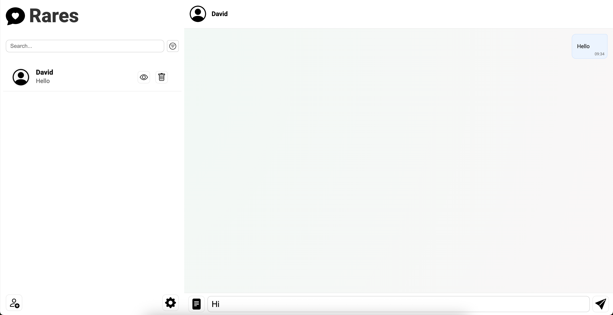
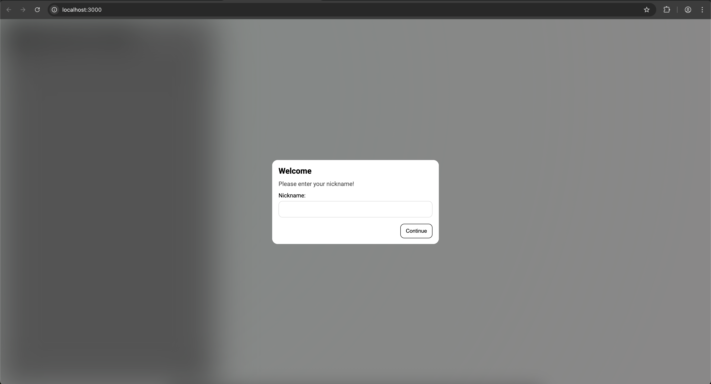
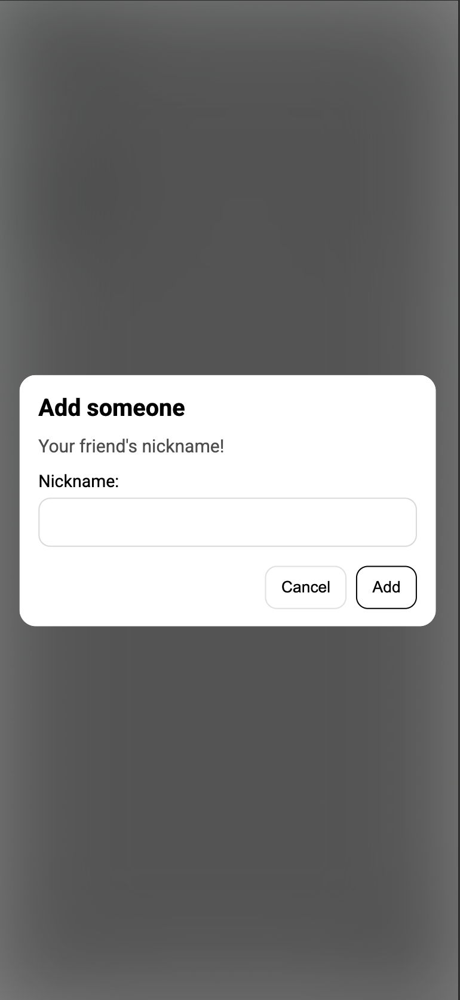
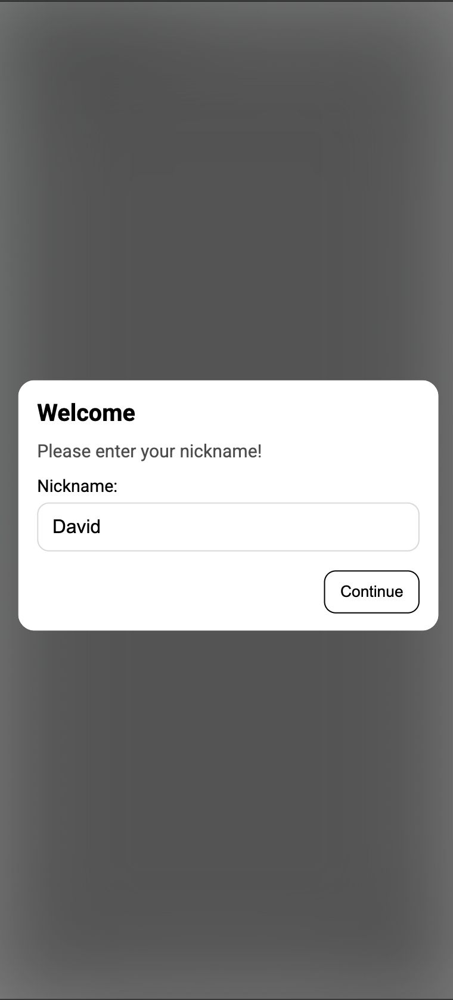
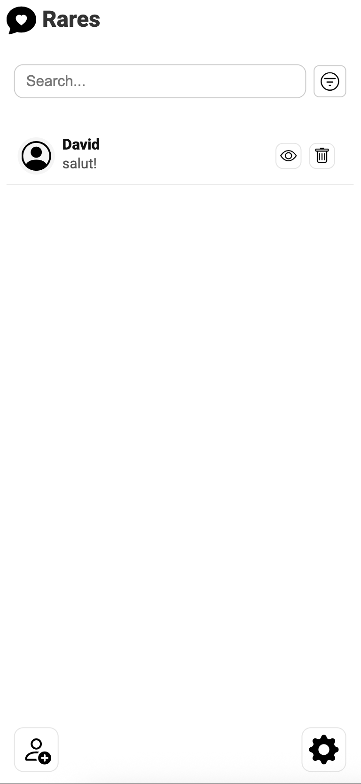
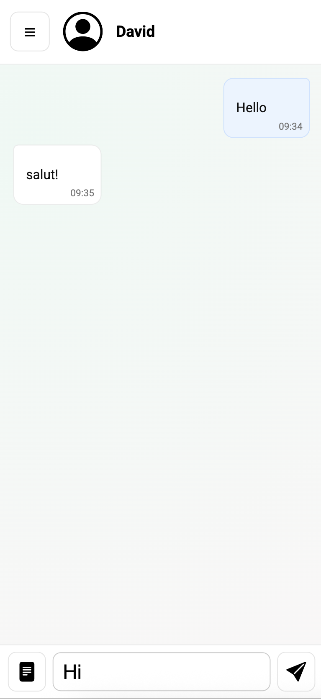

# Chatter

## UI

### PC Browser

### Mobile Browser

## Functionality

- add people to chat
- responsive
- real time
- multiple people support
- search people by username

## TODO

- ~~create mockup~~
- ~~build frontend MVP~~
- **_NOTE: WON'T HAVE for this iteration._**  de adaugat sunete
- ~~simple FTS+Regex search implemented in convo list for usernames~~
- **_NOTE: NICE TO HAVE for this iteration._** filter function
- ~~settings function~~
- ~~de facut fully responsive(hamburger menu dispare pe telefon)~~
- ~~de afisat numele utilizatorului in loc de header~~
- ~~de adaugat skeleton pentru messaging ap: socketio~~
- ~~takeout innerHTML=unsafe~~
- **_NOTE: WON'T HAVE for this iteration._** UI: de facut liquid glass , gradients , box shadows: 
- de facut web worker pentru web sockets
- json pentru stocare

## Mockup

